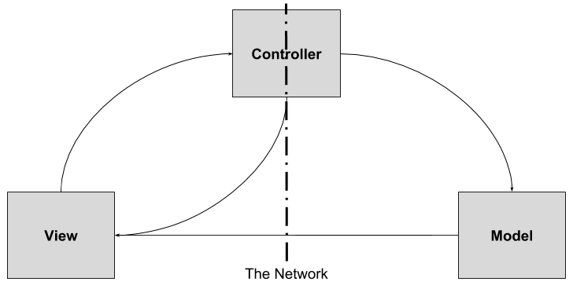

# Progetto Finale - Ingegneria del Software

##### Federico Piccinini ([APPiccio](https://github.com/APPiccio))
##### Tommaso Peresson ([t0mpere](https://github.com/t0mpere))
##### Francesco Peressini ([francescoperessini](https://github.com/francescoperessini)) 
------------------------------------------------------
## Come far partire il gioco ##
### Server
Posizionarsi nella cartella `jar/server` da terminale e utilizzare il comando `java -jar server.jar`
### Client
Per ogni client: posizionarsi nella cartella `jar/client` da terminale e utilizzare il comando `java -jar client.jar`

------------------------------------------------------
## 1. Test Coverage ##
- In accordo con quanto comunicato durante gli incontri di laboratorio, sono stati implementati i test del model cercando di ottenere una copertura completa del codice. Viene riportato di seguito il report della copertura effettuata tramite Sonar. 
- Overview generale dell'analisi:

- Test coverage:

------------------------------------------------------
## 2. UML ##
- Al fine di massimizzare la fruibilità e la leggibilità dei diagrammi delle classi UML si è deciso di creare un diagramma diverso per ogni package principale. In quest'ottica, i collegamenti tra classi di package differenti sono stati realizzati sostituendo alla classe esterna al package una referenza ad essa (la rappresentazione completa di tale classe è accessibile attraverso il diagramma del package corrispondente); 
    - <a href="https://github.com/APPiccio/ing-sw-2018-piccinini-peresson-peressini/blob/master/UML/ModelClassDiagram.pdf"> Model class diagram </a>
    - <a href="https://github.com/APPiccio/ing-sw-2018-piccinini-peresson-peressini/blob/master/UML/ViewClassDiagram.pdf"> View class diagram </a>
    - <a href="https://github.com/APPiccio/ing-sw-2018-piccinini-peresson-peressini/blob/master/UML/CardsClassDiagram.pdf"> Cards class diagram </a>
    - <a href="https://github.com/APPiccio/ing-sw-2018-piccinini-peresson-peressini/blob/master/UML/ControllerClassDiagram.pdf"> Controller class diagram </a>
    - <a href="https://github.com/APPiccio/ing-sw-2018-piccinini-peresson-peressini/blob/master/UML/NetworkClassDiagram.pdf"> Network class diagram </a>
    - <a href="https://github.com/APPiccio/ing-sw-2018-piccinini-peresson-peressini/blob/master/UML/UtilsClassDiagram.pdf"> Utils class diagram </a>
------------------------------------------------------
## 3. Funzionalità implementate ##
- Regole complete
- Connessione Socket
- Connessione RMI
- CLI
- GUI
- ### Funzionalità avanzate
    - Carte schema dinamiche
    - Partite multiple
------------------------------------------------------
## 4. Scelte implementative ##

- ### Scelte progettuali

    - #### MVC
    
        - ##### Model
            Possiede lo stato e la logica dell'applicazione.
            
        - ##### View
            Fornisce all'utente una rappresentazione del model.
            
        - ##### Controller
            Mappa gli input degli utenti provenienti dalla view per effettuare cambiamenti sul model.
            In questa implementazione del pattern MVC si è deciso di porre l'interfaccia di rete sul controller.
     
    
    - #### Osservatori
        Per realizzare un meccanismo di notifica è stato utilizzato un pattern __observer__. In particolare, il model e le 
        view rappresentano rispettivamente l'osservato e osservatore.
        Per quanto riguarda la connessione socket è stato necessario duplicare il pattern observer per permettere la 
        trasmissione delle notifiche (view osserva SocketClientController, SocketThread osserva il model).
        
    - #### Network
        Si è deciso di progettare la struttura di rete in modo tale da rendere invisibili, dal punto di vista implementativo
        della view, le differenze tra le diverse tipologie di connessione; per fare ciò si è sfruttato il polimorfismo 
        caratteristico di Java che ha permesso l'implementazione del cambio di modalità di connessione nel corso 
        della stessa sessione.
        
        - ##### RMI
            Si è deciso di far esportare dal server l'implementazione del controller.
            
        - ##### Socket
            Nella modalità di connessione socket, la funzionalità del controller viene suddivisa su due classi 
            (una lato client e una lato server) che si occupano dell'implementazione e della gestione delle interazioni 
            su socket.
            I messaggi sono stati suddivisi in: Request (client -> server) e Response/Notification (server -> client).
            È stato sfruttato il polimorfismo e il pattern __command__ per caratterizzare i singoli messaggi ricevuti
            dalla rete.
            Per interpretare i messaggi si sono utilizzate due classi (ResponseHandler, RequestHandler) facenti utilizzo 
            del pattern __visitor__.
            
    - #### Multithreading
        Si è reso necessario l'utilizzo della programmazione concorrente per eliminare ogni tipo di chiamata bloccante e 
        massimizzare l'esperienza multi-giocatore nei seguenti casi: 
        - implementazione socket server multi-client;
        - gestione dei timer di gioco;
        - non generare chiamate bloccanti nella procedura di acquisizione dati da utente (comandi di gioco, 
          parametri toolCard, ecc.) sia su CLI che su GUI.
          
    - #### ToolCard 
    
        - ##### Acquisizione 
            Si è scelto di separare la logica applicativa di ottenimento dei parametri delle toolCard dalla view 
            rendendo il codice più scalabile.
            Per fare ciò sono state implementate delle procedure elementari e comuni di acquisizione parametri lato view: 
            in seguito alla richiesta di utilizzo di una determinata toolCard da parte di un utente, inizia un meccanismo di
            "ping-pong" __asincrono__ fra view e controller.
            Entrando nel dettaglio, il controller (il quale è a conoscenza dei parametri da acquisire) segnala alla view la 
            necessità di ricevere un particolare dato mettendosi in attesa asincrona (in un thread differente da quello della
            view e del controller).
            Al termina di questo scambio di messaggi, il controller confeziona la richiesta e la invia al model.
            
        - ##### Controllo ed esecuzione
            Il model esegue inizialmente un controllo di correttezza dei parametri ricevuti e in caso positivo procede 
            all'utilizzo delle toolCard.
            Esse sono state realizzate sfruttando il polimorfismo di Java e il pattern __command__. 
            
    - #### Public Objective Card
        Avendo comportamenti simili tra loro, si è deciso di implementare le carte obiettivo pubblico utilizzando un pattern 
        __startegy__ che permette l'utilizzo di un determinato algoritmo sfruttango il polimorfismo di Java.     
            
    - #### Disconnessione 
        È stato implementato un meccanismo di rilevamento delle disconnessioni, volontarie e involontarie, sia lato client
        sia lato server.
        Le disconnessioni __volontarie__ dei client sono identificate da una richiesta inviata al server; nel caso di
        disconnessioni __involontarie__ il server le rileva attraverso la gestione delle eccezioni di rete (SocketException 
        e RemoteException). 
        Per ovviare al problema di assenza di stato di RMI è stato implementato un meccanismo di __ping__ in grado di 
        rilevare le disconnessioni involontarie attraverso il lancio della RemoteException.
        Nel caso il server non fosse più raggiungibile, il client si occuperà della gestione dell'eccezione di rete e 
        terminerà la sua esecuzione.
        
   - #### Riconnessione e giocatore sospeso
        Al fine di rendere possibile la riconnessione ad una partita in corso, nel momento di inizio della partita viene
        salvato un token in locale contenente i dati necessari ad una identificazione futura.
        Il server valuterà l'effettiva possibilità di riconnessione da parte del giocatore.
        A seguito di inattività durante il proprio turno, il giocatore viene sospeso e il gioco continua ignorandolo 
        fino al primo segnale di attività.
        
    - ### GUI
        Si è preferito implementare la GUI completamente da codice, non ricorrendo all'utilizzo di SceneBuilder o file ".fxml" generati         in maniera automatica, al fine di massimizzare la dinamicità dell'interfaccia. 
        
- ### Limitazioni ### 
    In fase di progettazione iniziale si sono delineate alcune funzionalità accessorie a bassa priorità da implementare 
    soltanto in fase di perfezionamento: 
    - animazioni e arricchimento grafico dell'esperienza utente;
    - cambio di modalità di connessione a partita in corso (funzionalità implementata parzialmente, usabile una sola
    volta per partita).
